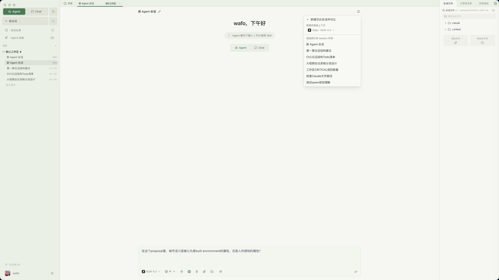
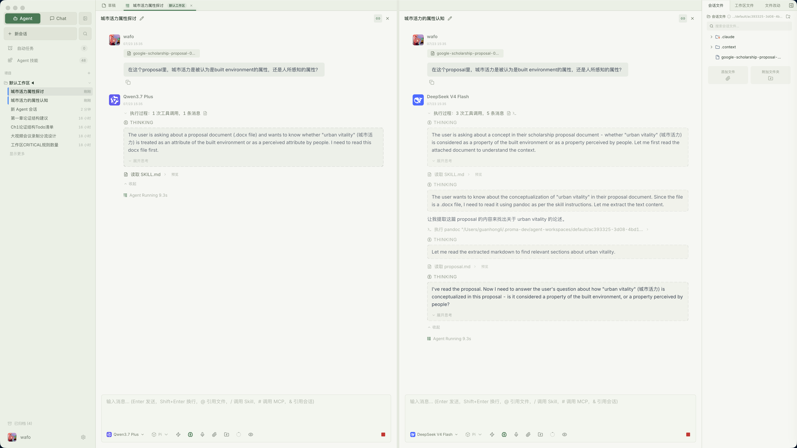
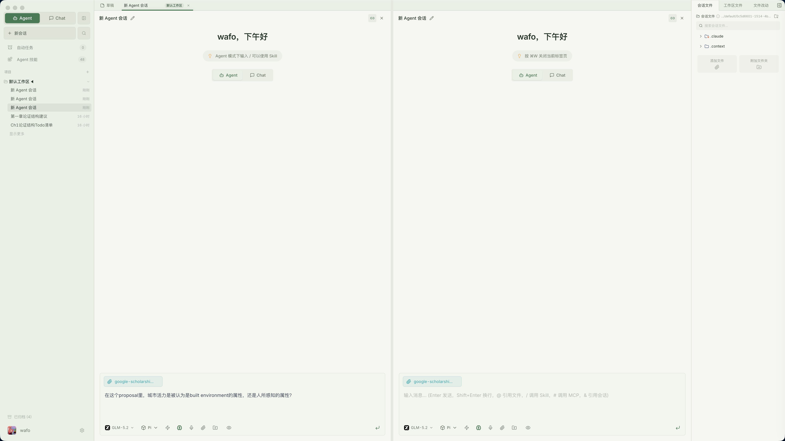

# Proma

Proma 是一个本地优先的 AI 桌面应用，把多模型 Chat、通用 Agent、工作区、Skills、MCP、远程机器人和记忆能力放在同一个开源客户端里。

它不是只面向闲聊的聊天框，而是一个可以长期沉淀个人工作流的 Agent 工作台：简单问题用 Chat，复杂任务交给 Agent，数据和配置尽量留在本地。


<video width="560" controls>
  <source src="https://img.erlich.fun/personal-blog/uPic/%E7%AE%80%E5%8D%95%E4%BB%8B%E7%BB%8D%20Proma.mp4" type="video/mp4">
</video>

[English README](./README.en.md) | [新手教程](./tutorial/tutorial.md) | [下载开源版](https://github.com/ErlichLiu/Proma/releases) | [下载商业版](https://proma.cool/download)

> **最新思考 ｜ 2026 Q2–Q3**：[勇敢地解决真实的问题 — Proactive · 个人注意力 · 团队协作](./proma-thinking/proma-2026-q2-q3-thinking.md) ｜ 往期思考：[2026 Q1](./proma-thinking/proma-2026-q1-thinking.md)

## 现在能做什么

- **Chat 模式**：多模型对话、附件解析、图片输入、Markdown / Mermaid / KaTeX / 代码高亮、并排对话、系统提示词、上下文管理。
- **Agent 模式**：内置 Claude Agent SDK 与 Pi Agent SDK 两套运行时；支持工作区隔离、权限模式、文件操作、长任务流式输出、计划确认和用户追问。Claude 是默认内核，Pi 可在实验性设置中开启。
- **协作与任务**：复杂任务可拆分为可追踪的协作子 Agent / Task，并在消息流中展示调用过程和结果。
- **Skills & MCP**：每个工作区可以独立配置 Skills、MCP Server 和工作区文件，适合沉淀可复用能力。
- **远程机器人**：支持飞书 / Lark 机器人桥接，并已提供钉钉、微信桥接入口，用手机或群聊触发本机 Agent 工作流。
- **记忆与工具**：Chat 和 Agent 可共享记忆能力，并支持联网搜索、内置 Chat 工具、Agent 推荐等辅助能力。
- **本地优先**：会话、工作区、附件、配置、Skills 等默认存储在 `~/.proma/`，使用 JSON / JSONL 文件组织，不依赖本地数据库。
- **桌面体验**：自动更新、代理设置、文件预览、全局快捷键、快速任务窗口、语音输入、亮色 / 暗色 / 跟随系统主题。

## 快速开始

### 下载安装

从 [GitHub Releases](https://github.com/ErlichLiu/Proma/releases) 下载开源版本，提供 macOS Apple Silicon、macOS Intel 和 Windows 安装包。

如果你希望开箱即用、减少 API 配置成本，也可以使用 [Proma 商业版](https://proma.cool/download)。商业版和开源版并行运行，主要区别是商业版提供内置渠道和订阅方案。

### 首次配置

1. 打开 Proma，先完成环境检查。Agent 模式依赖本机基础环境，尤其是 Git、Node.js / Bun 以及可用的 Shell。
2. 进入 **设置 > 渠道**，添加至少一个 AI 供应商渠道，填写 Base URL、API Key 和模型列表。
3. Chat 模式可以使用 OpenAI、Anthropic、Google 或 OpenAI 兼容协议的渠道。
4. 默认的 Claude Agent Runtime 需要 Anthropic 或 Anthropic 兼容协议渠道，例如 Anthropic、DeepSeek、Kimi API、Kimi Coding Plan。
5. Agent 输入框下方可直接切换 Claude / Pi 内核；Pi 可使用任意已启用的模型渠道。
6. 进入 **设置 > Agent**，选择默认 Agent 渠道、模型和工作区。
7. 如需记忆、联网搜索、飞书 / 钉钉 / 微信桥接，在设置页对应 Tab 中继续配置。

## 模式选择

### Chat 适合

- 日常问答、解释、翻译、润色、轻量代码讨论。
- 读取附件内容后做总结、改写、比较。
- 使用联网搜索或记忆工具增强一次性对话。
- 同时对比多个模型输出，或用不同系统提示词做探索。

### Agent 适合

- 修改、创建、整理本地文件。
- 调研、编写报告、处理多步骤任务。
- 使用 MCP、Skills、Shell、Git、项目文件等外部上下文。
- 需要权限确认、计划模式、后台任务或远程机器人持续跟进的工作。

简单说：**只需要回答时用 Chat，需要行动和交付结果时用 Agent。**

## 截图

### Chat 快速分析

用 Chat 处理轻量但真实的分析任务：整理读者关注点、生成对比表，并把首屏文案快速定稿。


### Agent 工作台

Agent 在工作区里读取文件、推进任务、输出表格化结论，并把可复用文件保留在右侧工作区面板中。


### Agent 双侧分屏对比

Proma 的 Agent 双侧分屏允许将两个独立的 Agent session 并排查看和操作，用于比较不同 Provider、模型或 Agent runtime 对同一任务的处理结果。两个 session 保持各自独立的消息历史、运行状态、模型配置和工作目录，因此可以分别调整模型、单独继续其中一侧，或将其中一侧作为后续收敛会话。

用户可以从 session 顶部的“分屏对比”入口选择已有 session、新建空白对比 session，或新建并继承当前上下文的对比 session。继承时，同渠道且具备 SDK session 的 Claude runtime 使用原生 fork；Pi runtime、跨渠道或没有 SDK session 的场景则通过文本上下文注入创建新会话。若源 session 仍在运行，继承请求会作为待办保留，待本轮完成后自动执行。(一般我们认为用户是用尝试两个不同的模型)



分屏绑定后，联动开关控制两侧是否同步处理新的输入。联动开启时，在任一侧发送 prompt 会同时发送到另一侧；联动关闭时，两侧完全独立，可用于选择更优结果、继续深化某一侧，或让第三个模型汇总已有结论。左侧 session 列表也提供“进入分屏”操作，用于不绑定、不开联动地并排查看两个 session。（目前的设计我们只允许并排查看两个session，因为两个session我们认为是用户同时处理信息的上限，如果需要更多并发session，建议走proma的collaboration agent）



附件遵循与联动相同的事件语义。联动开启时，一侧新增或移除附件会同步到另一侧；发送时，源 session 会将已经稳定化的附件绝对路径、文件引用和目录访问权限一并传递给 partner，确保两侧读取同一份材料，而不是由另一侧自行从工作区寻找可能更新过的版本。联动关闭后，两侧附件草稿可以自然分叉；重新开启联动不会自动合并旧草稿，用户再次添加某个文件即可恢复该文件的同步。右侧文件面板跟随当前点击的分屏栏位，以便分别查看和添加左右两个 session 的会话文件。



### Skills

每个工作区都可以沉淀专属 Skills。截图中的 `feedback-synthesis` 用于把用户反馈、访谈记录和 issue 聚合成主题、证据与优先级建议。


### Skills & MCP

同一个工作区可以管理 stdio / HTTP MCP Server，按需启用或关闭，让 Agent 在不同项目里获得不同的外部上下文。


### 流式语音输入(支持全局输入)
Proma 支持豆包的流式语音输入功能，并且支持在 Proma 内使用和 Proma 外部使用：
- Proma 内部使用：Ctrl + ` 触发识别，再次按下结束自动输入到 Proma 内对应的输入框
- Proma 外部使用：Ctrl + ` 触发识别，再次按下结束自动输入到当前的光标所在处，如无光标则默认写入到剪贴板
- 


## Agent 运行时与模型渠道

Proma 的 Agent 模式提供两套可切换的内核：

- **Claude Agent Runtime（默认）**：基于 `@anthropic-ai/claude-agent-sdk`，使用 Anthropic Messages API 或兼容端点。
- **Pi Agent Runtime**：基于 `@earendil-works/pi-coding-agent`、`pi-agent-core` 和 `pi-ai`，将 Proma 的已启用渠道动态注册为 Pi provider；支持 OpenAI Chat Completions / Responses、Google Generative AI、Anthropic Messages 及其兼容端点。

| 渠道类型 | Chat | Claude Agent | Pi Agent |
| --- | --- | --- | --- |
| Anthropic / Anthropic 兼容 | 支持 | 支持 | 支持 |
| DeepSeek、Kimi API / Coding Plan、智谱 Coding Plan、MiniMax、小米 MiMo 等 Anthropic 协议渠道 | 支持 | 支持 | 支持 |
| OpenAI、OpenAI Responses、Google、智谱 AI、豆包、通义千问 | 支持 | 暂不支持 | 支持 |
| OpenAI 兼容自定义端点 | 支持 | 暂不支持 | 支持 |
| ChatGPT 订阅（Codex OAuth） | — | 支持 | 支持 |

> Pi Runtime 可在每个 Agent 会话的输入框下方直接切换；切换会开启新的底层 SDK 会话，但不会删除 Proma 中已保存的消息。Pi 会桥接工作区 Skills、用户 MCP Server，以及 Proma 内置的 Automation / Collaboration 工具；不同模型供应商对工具调用、推理和上下文长度的支持仍可能不同。

> **Kimi Coding Plan 用户须知**：Proma 已获得 Kimi 官方白名单支持，使用 Proma 连接 Kimi Coding Plan 不会触发第三方客户端封号策略，可放心使用。

## 本地数据

Proma 采用本地文件存储，方便备份、迁移和排查问题。

```text
~/.proma/
├── channels.json
├── conversations.json
├── conversations/
│   └── {conversation-id}.jsonl
├── agent-sessions.json
├── agent-sessions/
│   └── {session-id}.jsonl
├── agent-workspaces/
│   └── {workspace-slug}/
│       ├── workspace-files/
│       ├── mcp.json
│       └── skills/
├── attachments/
├── user-profile.json
├── settings.json
└── sdk-config/
```

API Key 会通过 Electron `safeStorage` 加密后写入 `channels.json`。Proma 不使用本地数据库，核心数据结构以 JSON 配置和 JSONL 追加日志为主。

## 开发

Proma 是 Bun workspace monorepo。

```text
proma-v2/
├── packages/
│   ├── shared/     # 共享类型、IPC 常量、配置、工具函数
│   ├── core/       # Provider Adapter、SSE、代码高亮
│   └── ui/         # 共享 React UI 组件
└── apps/
    └── electron/   # Electron 桌面应用
```

当前主要包版本：

| 包 | 版本 | 职责 |
| --- | --- | --- |
| `@proma/electron` | `0.15.0` | Electron 桌面应用 |
| `@proma/shared` | `0.1.42` | 共享类型、IPC 常量、配置和工具 |
| `@proma/core` | `0.2.15` | Provider Adapter、SSE、Shiki 高亮 |
| `@proma/ui` | `0.1.9` | 共享 React UI 组件 |

常用命令：

```bash
# 安装依赖
bun install

# 开发模式：自动启动 Vite + Electron + 热重载
bun run dev

# 构建 Electron 应用
bun run electron:build

# 构建并运行
bun run electron:start

# 类型检查
bun run typecheck

# 测试
bun test
```

Electron 子应用内也提供更细的脚本：

```bash
cd apps/electron

bun run dev:vite
bun run dev:electron
bun run build:main
bun run build:preload
bun run build:renderer
bun run dist:fast
```

## 技术栈

| 层级 | 技术 |
| --- | --- |
| 运行时 | Bun |
| 桌面框架 | Electron 39 |
| 前端 | React 18 + TypeScript |
| 状态管理 | Jotai |
| 样式 | Tailwind CSS + Radix UI |
| 富文本输入 | TipTap |
| Markdown / 图表 / 公式 | React Markdown + Beautiful Mermaid + KaTeX |
| 代码高亮 | Shiki |
| 构建 | Vite + esbuild |
| 分发 | electron-builder |
| Agent Runtime | Claude: `@anthropic-ai/claude-agent-sdk@0.3.201`；Pi: `@earendil-works/pi-* @0.80.3` |

## 架构概览

Proma 的核心通信路径是：

```text
shared 类型和 IPC 常量
  -> main/ipc.ts 注册处理器
  -> preload/index.ts 暴露 window.electronAPI
  -> renderer Jotai atoms 和 React 组件调用
```

主进程服务集中在 `apps/electron/src/main/lib/`：

- `agent-orchestrator.ts`：Agent 编排、运行时路由、环境变量、SDK 调用、事件流、错误处理。
- `adapters/claude-agent-adapter.ts` / `adapters/pi-agent-adapter.ts`：Claude 与 Pi 运行时适配；`runtime-routing-agent-adapter.ts` 依据会话内核路由。
- `agent-session-manager.ts`：Agent 会话索引和 JSONL 消息持久化。
- `agent-workspace-manager.ts`：工作区、MCP、Skills 和工作区文件管理。
- `chat-service.ts`：Chat 流式调用、Provider Adapter、工具活动。
- `conversation-manager.ts`：Chat 会话索引和消息存储。
- `channel-manager.ts`：渠道 CRUD、API Key 加密、连接测试、模型获取。
- `feishu-bridge.ts` / `dingtalk-bridge.ts` / `wechat-bridge.ts`：远程机器人桥接。
- `chat-tool-*`、`document-parser.ts`、`workspace-watcher.ts`：工具、文档解析和文件监听。

渲染进程以 Jotai 管理状态，关键 atoms 位于 `apps/electron/src/renderer/atoms/`。Agent IPC 监听器在应用顶层全局挂载，避免切换页面时丢失流式事件、权限请求或后台任务状态。

## 打包注意事项

Claude 与 Pi 运行时都在主进程中作为 esbuild external 依赖运行。`apps/electron` 的打包脚本会在 `electron-builder` 前执行 `bun run sync:runtime-deps`，把下列依赖及其运行时闭包复制到应用目录：

- `@anthropic-ai/claude-agent-sdk`（包含按平台分发的 Claude native binary）
- `@earendil-works/pi-coding-agent`、`pi-agent-core`、`pi-ai`
- Pi 运行时所需的原生模块和 `pdfjs-dist`

修改打包配置时，请确认：

- `build:main` / `watch:main` 仍将两套 Agent SDK 标记为 external。
- `scripts/sync-runtime-deps.ts` 的 external runtime 清单与实际依赖一致。
- `electron-builder.yml` 保留 Claude binary 与 Pi native addon 的 `asarUnpack` 规则。
- 在目标平台测试 `bun run dist:fast` 后，分别验证 Claude 与 Pi（若已启用）可以启动、调用工具和恢复会话。

更完整的工程约定见 [AGENTS.md](./AGENTS.md)。

## 贡献

欢迎修 Bug、补文档、加测试、完善体验，也欢迎围绕真实场景提交新的 Skills、MCP 配置或 Agent 工作流。

提交 PR 前建议先确认：

- 使用 Bun 运行脚本，不混用 npm / pnpm lockfile。
- 状态管理使用 Jotai。
- 尽量保持本地优先，优先使用配置文件和 JSON / JSONL。
- TypeScript 不使用 `any`，对象结构优先使用 `interface`。
- 新增 IPC 时同步修改 shared 类型、main handler、preload bridge 和 renderer 调用。
- 影响包行为时递增对应 package 的 patch 版本。
- 能用测试覆盖的行为尽量补上测试，尤其是共享逻辑、IPC 契约和持久化格式。

## 作者

- 个人网站：[erlich.fun](https://erlich.fun)

## Star History

<a href="https://www.star-history.com/?repos=ErlichLiu%2FProma&type=date&legend=top-left">
 <picture>
   <source media="(prefers-color-scheme: dark)" srcset="https://api.star-history.com/chart?repos=ErlichLiu/Proma&type=date&theme=dark&legend=top-left" />
   <source media="(prefers-color-scheme: light)" srcset="https://api.star-history.com/chart?repos=ErlichLiu/Proma&type=date&legend=top-left" />
   
 </picture>
</a>


## 致谢

- [Shiki](https://shiki.style/)：代码高亮。
- [Beautiful Mermaid](https://github.com/lukilabs/beautiful-mermaid) 与 [Mermaid](https://mermaid.js.org/)：Mermaid 图表渲染与官方兜底渲染。
- [Cherry Studio](https://github.com/CherryHQ/cherry-studio)：多供应商桌面 AI 产品启发。
- [Lobe Icons](https://github.com/lobehub/lobe-icons)：AI / LLM 品牌图标。
- [Craft Agents OSS](https://github.com/lukilabs/craft-agents-oss)：Agent SDK 集成模式参考。

## 许可证

Proma 社区版采用 [GNU Affero General Public License v3.0（AGPL-3.0）](./LICENSE) 开源，完整条款见根目录 `LICENSE` 文件。

**个人 / 非商业使用**：自由使用、修改、分发，仅需遵守 AGPL-3.0 条款。

**商业使用**：在完全遵守 AGPL-3.0 条款的前提下允许进行商业使用，包括但不限于：以源代码或修改后的形式分发软件、通过网络对外提供服务时必须公开完整修改源码（含网络交互层）、衍生作品须以 AGPL-3.0 继续授权。

**商业授权（豁免 AGPL-3.0 义务）**：如果你希望将 Proma 集成到闭源产品、对外提供 SaaS 服务但不想公开衍生代码，或有其他无法满足 AGPL-3.0 条款的商业场景，请通过邮件联系获取商业许可：[erlichliu@gmail.com](mailto:erlichliu@gmail.com)。

向本项目提交 Pull Request 即视为同意将贡献以 AGPL-3.0 及未来商业许可形式授权给项目维护者。
